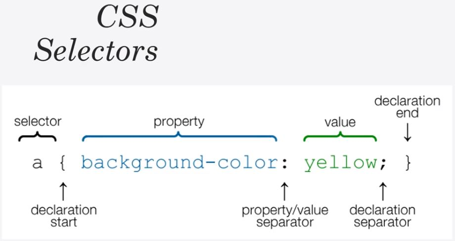

## Methods for adding CSS

- Inline CSS - Directly in the HTML(not recommended)
- Internal CSS - Using `<style>` tags within a single document
- ***External CSS*** - Linking an external `.css` file

## CSS Selectors

## Color names
- Color names
- HTML5 color names
- Hexadecimal
- RGB

**Fonts** - Using web-safe fonts doesn't require importing them into the HTML. `Times New Roman` is the default font in most browsers.

## Positioning
- *Static* (default)
- Relative
- Absolute
- Fixed
- Initial
- Inherit
